  
  

  
  
  
  

 

## 🏠 Profile Overview

<table>
  <tr>
    <td><strong>Name</strong></td>
    <td>Ravano Akbar Widodo</td>
  </tr>
  <tr>
    <td><strong>Username</strong></td>
    <td><a href="https://github.com/ravano-2464">@ravano-2464</a></td>
  </tr>
  <tr>
    <td><strong>Current Role</strong></td>
    <td>Full Stack Developer</td>
  </tr>
  <tr>
    <td><strong>Company</strong></td>
    <td>EDIfly Solution Indonesia</td>
  </tr>
  <tr>
    <td><strong>Base</strong></td>
    <td>Jakarta, Indonesia</td>
  </tr>
  <tr>
    <td><strong>Brand Position</strong></td>
    <td>Senior-minded engineer building scalable SaaS, AI-first products, and secure developer platforms</td>
  </tr>
</table>

## 🧑‍💻 About Me

I build full-stack software products with a product-first engineering mindset. My core focus is delivering scalable SaaS applications, AI-powered workflows, and developer tools that stay reliable in production.  
From architecture design to deployment pipelines, I prioritize clean boundaries, type-safe systems, fast iteration, and security-first implementation. I am especially interested in practical AI products, automation systems, and engineering patterns that help teams ship faster with higher quality.

## 🌐 Connect With Me

  
  
  

## 🚀 Featured Projects

<table>
  <tr>
    <td width="50%" valign="top">
      <h3>VeriText</h3>
      
Enterprise-grade AI text detection platform built for trust workflows, content validation, and decision-ready analytics.

      
<strong>Main Technologies:</strong> Next.js, NestJS, TypeScript, PostgreSQL, Prisma, Redis, BullMQ, Docker

      
<strong>Repository Frontend:</strong> <a href="https://github.com/ravano-2464/VeriText-Frontend">github.com/ravano-2464/VeriText-Frontend</a>

      
<strong>Repository Backend:</strong> <a href="https://github.com/ravano-2464/VeriText-Backend">github.com/ravano-2464/VeriText-Backend</a>

      
<strong>Impact:</strong> Provides a production-focused foundation for AI-authenticity verification systems used in high-volume content pipelines.

    </td>
    <td width="50%" valign="top">
      <h3>Sonara Web Apps</h3>
      
Modern web application suite focused on premium UI, realtime media experience, and SaaS-ready architecture.

      
<strong>Main Technologies:</strong> Next.js, TypeScript, Tailwind CSS, Zustand, Howler.js, WaveSurfer.js, Supabase

      
<strong>Repository:</strong> <a href="https://github.com/ravano-2464/Sonara-Web-Apps">github.com/ravano-2464/Sonara-Web-Apps</a>

      
<strong>Impact:</strong> Demonstrates how polished product UX and scalable backend services can be combined in a fast-moving MVP stack.

    </td>
  </tr>
  <tr>
    <td width="50%" valign="top">
      <h3>Media Forge</h3>
      
All-in-one media utility platform for conversion, processing, and automation with a scalable full-stack workflow model.

      
<strong>Main Technologies:</strong> Next.js, TypeScript, Express, Queue Workers, Realtime Channels, Docker

      
<strong>Repository:</strong> <a href="https://github.com/ravano-2464/Media-Forge">github.com/ravano-2464/Media-Forge</a>

      
<strong>Impact:</strong> Accelerates creator and operations workflows by reducing manual media handling through automation-first tooling.

    </td>
    <td width="50%" valign="top">
      <h3>Ultimate SaaS Boilerplate</h3>
      
Production-grade multi-tenant SaaS starter with RBAC, subscriptions, queue workers, audit logs, and admin tooling.

      
<strong>Main Technologies:</strong> TypeScript, Node.js, PostgreSQL, WebSocket, Queue System, Swagger, Docker

      
<strong>Repository:</strong> <a href="https://github.com/ravano-2464/Ultimate-SaaS-Boilerplate">github.com/ravano-2464/Ultimate-SaaS-Boilerplate</a>

      
<strong>Impact:</strong> Cuts time-to-market for serious SaaS products by shipping core business architecture out of the box.

    </td>
  </tr>
</table>

## 🛠 Tech Stack

### 🎨 Frontend

### ⚙ Backend

### 🗄 Database

### ☁ DevOps & Cloud

### 🤖 AI & Automation

### 🔒 Security

### 📱 Mobile

### 🖥 Desktop

## 🏗 Architecture Principles

<table>
  <tr>
    <td width="33%" valign="top">
      <strong>✔ Clean Architecture</strong> 
      Domain boundaries are explicit, decoupled, and maintainable over long product cycles.
    </td>
    <td width="33%" valign="top">
      <strong>✔ SOLID Principles</strong> 
      Components are extensible, testable, and resilient against feature growth.
    </td>
    <td width="33%" valign="top">
      <strong>✔ Type Safety</strong> 
      End-to-end typed contracts reduce regressions and increase delivery confidence.
    </td>
  </tr>
  <tr>
    <td width="33%" valign="top">
      <strong>✔ Scalable Systems</strong> 
      Queues, caching, and modular services are designed for high-throughput workloads.
    </td>
    <td width="33%" valign="top">
      <strong>✔ Security First</strong> 
      Secure defaults, auth hardening, and defensive checks are embedded from day one.
    </td>
    <td width="33%" valign="top">
      <strong>✔ Automation & DX</strong> 
      CI/CD, code quality gates, and automation workflows accelerate reliable shipping.
    </td>
  </tr>
</table>

## 📂 Active Repositories

<table>
  <tr>
    <th>Repository</th>
    <th>Focus</th>
    <th>Primary Stack</th>
  </tr>
  <tr>
    <td><a href="https://github.com/ravano-2464/VeriText">VeriText</a></td>
    <td>AI text authenticity platform</td>
    <td>TypeScript, Next.js, NestJS, PostgreSQL</td>
  </tr>
  <tr>
    <td><a href="https://github.com/ravano-2464/Sonara-Web-Apps">Sonara-Web-Apps</a></td>
    <td>SaaS-ready media web application</td>
    <td>TypeScript, Next.js, Supabase</td>
  </tr>
  <tr>
    <td><a href="https://github.com/ravano-2464/Media-Forge">Media-Forge</a></td>
    <td>Media processing and automation suite</td>
    <td>TypeScript, Next.js, Express</td>
  </tr>
  <tr>
    <td><a href="https://github.com/ravano-2464/Ultimate-SaaS-Boilerplate">Ultimate-SaaS-Boilerplate</a></td>
    <td>Multi-tenant SaaS starter architecture</td>
    <td>TypeScript, Node.js, PostgreSQL</td>
  </tr>
</table>

### Auto-Updated Repository Pulse

<!-- RECENT_REPOS:START -->
| Repository | Main Language | Last Update |
|---|---|---|
| [VeriText-Frontend](https://github.com/ravano-2464/VeriText-Frontend) | TypeScript | 31 July 2026 |
| [VeriText-Backend](https://github.com/ravano-2464/VeriText-Backend) | TypeScript | 30 July 2026 |
| [Keyboard-Auto-Clicker](https://github.com/ravano-2464/Keyboard-Auto-Clicker) | JavaScript | 20 May 2026 |
| [Sonara-Web-Apps](https://github.com/ravano-2464/Sonara-Web-Apps) | TypeScript | 20 May 2026 |
| [Media-Forge](https://github.com/ravano-2464/Media-Forge) | TypeScript | 18 May 2026 |
| [Ultimate-SaaS-Boilerplate](https://github.com/ravano-2464/Ultimate-SaaS-Boilerplate) | TypeScript | 12 May 2026 |
| [CatatUangku](https://github.com/ravano-2464/CatatUangku) | TypeScript | 26 April 2026 |
<!-- RECENT_REPOS:END -->

## 📊 GitHub Analytics

  
  

### Auto-Updated Language Snapshot

<!-- LANGUAGE_SNAPSHOT:START -->
_Automatically generated from active, non-fork public repositories. Counts represent each repository's primary language._

  
  
  
  
  
  

- **Frontend repositories:** 45
- **Backend repositories:** 14
- **Other or mixed repositories:** 1
- **Total repositories analyzed:** 60
<!-- LANGUAGE_SNAPSHOT:END -->

  

## 📈 Contribution Activity

  

## 🐍 Contribution Snake

  

## 🎯 Current Mission

<table>
  <tr>
    <th>Track</th>
    <th>Current Direction</th>
  </tr>
  <tr>
    <td><strong>Current Focus</strong></td>
    <td>Building high-quality SaaS products with AI-native capabilities and strong reliability standards.</td>
  </tr>
  <tr>
    <td><strong>Current Products</strong></td>
    <td>VeriText, Sonara Web Apps, Media Forge, and Ultimate SaaS Boilerplate.</td>
  </tr>
  <tr>
    <td><strong>Current Learning Path</strong></td>
    <td>Advanced scalable architecture, AI workflow orchestration, and production-grade security engineering.</td>
  </tr>
  <tr>
    <td><strong>Current Goals</strong></td>
    <td>Build software products that deliver real value to thousands of users and strengthen open-source credibility.</td>
  </tr>
</table>

## 🗺 Developer Journey

<table>
  <tr>
    <th>Stage</th>
    <th>Journey Milestone</th>
    <th>Growth Outcome</th>
  </tr>
  <tr>
    <td>Foundation</td>
    <td>Started with core programming, frontend fundamentals, and early project-based learning.</td>
    <td>Built technical discipline and consistent shipping habits.</td>
  </tr>
  <tr>
    <td>Full-Stack Expansion</td>
    <td>Moved into backend systems, API design, database modeling, and deployment workflows.</td>
    <td>Developed end-to-end product engineering capability.</td>
  </tr>
  <tr>
    <td>Product Engineering</td>
    <td>Built SaaS applications and platform tooling with strong focus on UX, scalability, and maintainability.</td>
    <td>Shifted from coding features to building complete products.</td>
  </tr>
  <tr>
    <td>AI & Security Depth</td>
    <td>Integrated AI-driven workflows and strengthened security-first architecture across projects.</td>
    <td>Positioned as a modern builder for AI and trustworthy software systems.</td>
  </tr>
  <tr>
    <td>Current Level</td>
    <td>Leading production-focused projects with startup execution speed and engineering rigor.</td>
    <td>Operating as a senior-minded full stack engineer and open-source contributor.</td>
  </tr>
</table>

## 🔬 Current Learning

<table>
  <tr>
    <td>AI product reliability patterns for real-world user workflows</td>
  </tr>
  <tr>
    <td>Security research techniques for web and API ecosystems</td>
  </tr>
  <tr>
    <td>Scalable SaaS architecture with observability and automation</td>
  </tr>
  <tr>
    <td>Developer tooling that improves team velocity and code quality</td>
  </tr>
</table>

## 🏆 Achievements

  <!-- TROPHY_IMAGE:START -->

<!-- TROPHY_IMAGE:END -->

> [!TIP]
> ### 🌌 Profile Milestones & Core Achievements
> 
> - 🚀 **Milestones** — Published 60+ public repositories since November 2022 and actively maintained modern TypeScript-focused projects.
> - 📦 **Open Source Delivery** — Released full-stack repositories covering AI, SaaS, media utilities, automation, and architecture-first boilerplates.
> - ⚙️ **Engineering Scope** — Built across web, backend, mobile, and desktop domains with consistent shipping cadence.
> - 🎯 **Product Mindset** — Transitioned from learning projects to production-oriented systems designed for real user value.

## 💡 Open Source Goals

<table>
  <tr>
    <td>Build impactful software products that solve practical user and engineering problems.</td>
  </tr>
  <tr>
    <td>Contribute meaningful improvements and reusable tooling to open-source ecosystems.</td>
  </tr>
  <tr>
    <td>Launch SaaS products with maintainable architecture and transparent developer experience.</td>
  </tr>
  <tr>
    <td>Advance AI product capabilities with responsible, production-ready engineering practices.</td>
  </tr>
  <tr>
    <td>Strengthen security-focused development culture across all shipped projects.</td>
  </tr>
</table>

## 🛣 Future Roadmap

| Focus Area | 2026 Roadmap | Strategic Outcome |
| --- | --- | --- |
| AI Products | Launch next-generation AI assistants and verification workflows | Practical automation that improves quality and decision speed |
| SaaS Products | Scale multi-tenant products with billing, observability, and growth loops | Sustainable product ecosystem with recurring value |
| Security Research | Build defensive security utilities and audit-ready pipelines | Stronger trust posture for users and teams |
| Open Source Projects | Publish reusable templates, reference architectures, and documented frameworks | Higher engineering leverage for the community |
| Developer Tools | Ship productivity tools for code quality, automation, and workflow acceleration | Faster delivery with fewer regressions |

## 📬 Contact

  
  

 

  Built with precision, product thinking, and long-term engineering standards. 
  Ravano Akbar Widodo • Full Stack Developer • Open Source Builder

